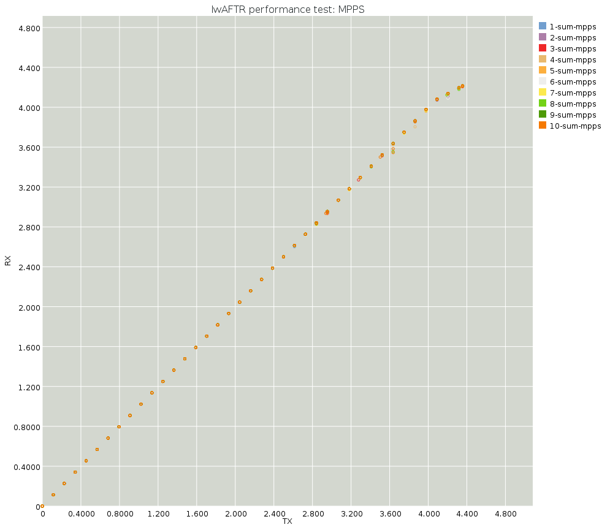
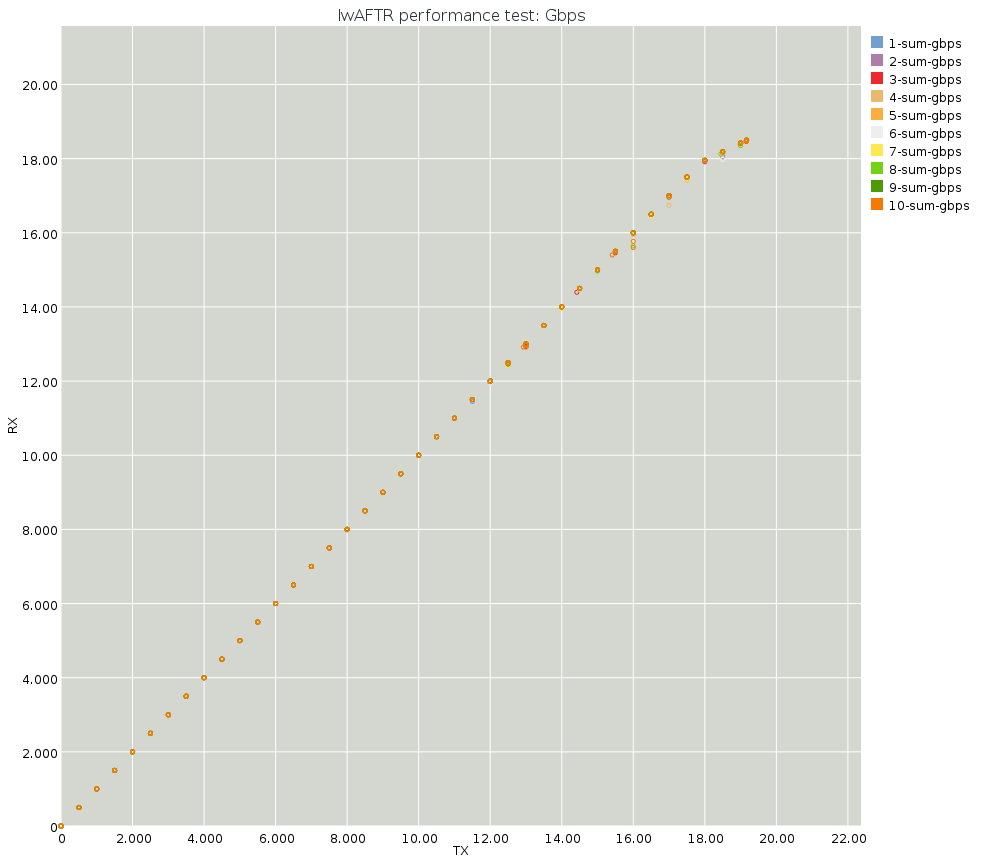
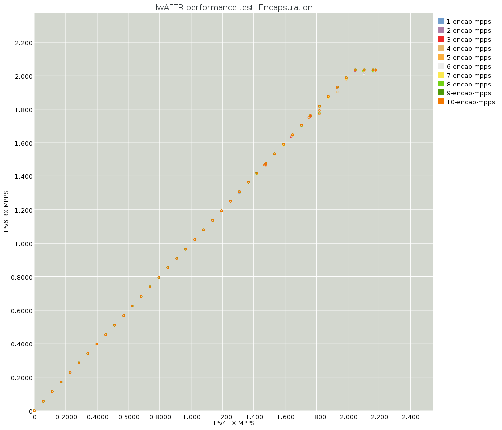
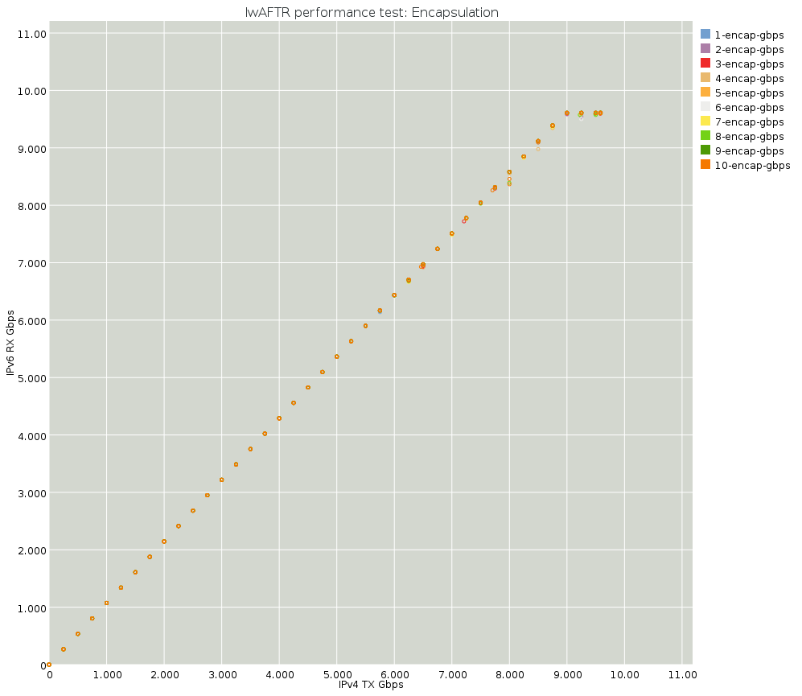
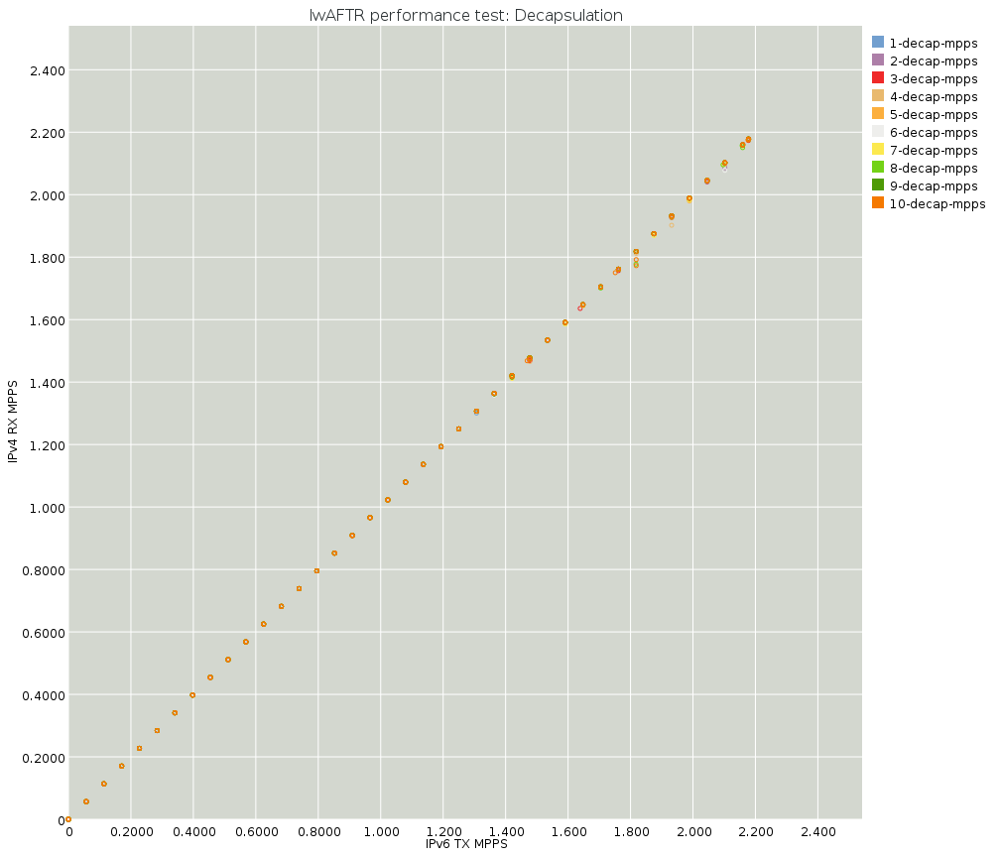

# Benchmarking

The instructions in [README.running.md](README.running.md) for running the lwaftr
 with a load generator are the instructions for the primary way to benchmark the lwaftr.

To run a load generator and a lwAFTR, you will need 4 NICs. The following 
example assumes NICs `02:00.0` and `02:00.1` and wired to NICs `02:00.0` and
`02:00.1` in a different server.

Please, change the PCI addresses to match the settings in your current system; 
See [README.running.md](README.running.md).

In one server, start the lwAFTR:

```
$ sudo taskset -c 1 ./src/snabb-lwaftr run -v \
    --conf program/lwaftr/tests/data/icmp_on_fail.conf \
    --v4-pci 0000:02:00.0 --v6-pci 0000:02:00.1
```

The `-v` flag enables periodic printouts reporting MPPS and Gbps statistics per
NIC.

In the other server, run the `loadtest` command:

```
$ sudo taskset -c 1 ./snabb-lwaftr loadtest -D 1 -b 10e9 -s 0.2e9 \
    program/lwaftr/tests/benchdata/ipv4-0550.pcap "NIC 0" "NIC 1" 02:00.0 \
    program/lwaftr/tests/benchdata/ipv6-0550.pcap "NIC 1" "NIC 0" 02:00.1
```

The loadtest command will ramp up from 0 Gbps to 10 Gbps.  At each step it measures
the return traffic from the lwAFTR, and prints out all this information
to the console.  The load generator stops when the test is done.

## NUMA

Each NIC is associated with a NUMA node.  For systems with multiple NUMA
nodes, usually if you have more than one socket, you will need to ensure
that the processes that access NICs do so from the right NUMA node.

For example if you are going to be working with NICs `0000:01:00.0`,
`0000:01:00.1`, `0000:02:00.0`, and `0000:02:00.1`, check:

```bash
$ for device in 0000:0{1,2}:00.{0,1}; do \
    echo $device; cat /sys/bus/pci/devices/$device/numa_node; \
  done
0000:01:00.0
0
0000:01:00.1
0
0000:02:00.0
0
0000:02:00.1
0
```

So all of these are on NUMA node 0.  Then check your CPUs:

```
$ numactl -H | grep cpus
node 0 cpus: 0 1 2 3 4 5
node 1 cpus: 6 7 8 9 10 11
```

So for these we should run our binaries under `taskset -c CPU` to bind
them to CPUs in the NUMA node 0.

## Performance charts

## Version 1.0












## Version 2.0

Charts are not available at this moment.  

Version 2.0 fixes packet loss for small binding tables, however there are 
still packet loss reported for big binding tables.  

The excerpts below show maximum peformance peak before packets start to lose
for a small binding table and large binding table.  As it was mentioned, small
binding tables reach linerate speed without reporting packet loss.

Small binding table:

```
Applying 10.000000 Gbps of load.
  NIC 0:
    TX 2178555 packets (2.178555 MPPS), 1198205250 bytes (9.585642 Gbps)
    RX 2037552 packets (2.037552 MPPS), 1202155680 bytes (9.617245 Gbps)
    Loss: 141003 packets (6.472318%)
  NIC 1:
    TX 2178567 packets (2.178567 MPPS), 1198211850 bytes (9.585695 Gbps)
    RX 2178567 packets (2.178567 MPPS), 1111069170 bytes (8.888553 Gbps)
    Loss: 0 packets (0.000000%)
```

Large binding table:
    
```
Applying 10.000000 Gbps of load.
NIC 0:
    TX 2178323 packets (2.178323 MPPS), 1198077650 bytes (9.584621 Gbps)
    RX 1696703 packets (1.696703 MPPS), 1001054770 bytes (8.008438 Gbps)
Loss: 481620 packets (22.109669%)
    NIC 1:
    TX 2178299 packets (2.178299 MPPS), 1198064450 bytes (9.584516 Gbps)
    RX 1696739 packets (1.696739 MPPS), 865336890 bytes (6.922695 Gbps)
Loss: 481560 packets (22.107158%)
```

See the [Small binding table loadtest][benchmarks-v2.0/loadtest.txt] and the
[Large binding table loadtest][benchmarks-v2.0/loadtest-small.txt] reports for
more information.

## Approximate benchmarking, without physical NICs

To get an idea of the raw speed of the lwaftr without interaction with NICs,
or check the impact of changes on a development machine that may not have
Intel 82599 NICs, `snabb-lwaftr bench` may be used:

### Small binding table

```bash
$ sudo ./snabb-lwaftr bench program/lwaftr/tests/data/icmp_on_fail.conf \
   program/lwaftr/tests/benchdata/ipv4-0550.pcap \
   program/lwaftr/tests/benchdata/ipv6-0550.pcap

loading compiled binding table from program/lwaftr/tests/data/binding-table.o
compiled binding table program/lwaftr/tests/data/binding-table.o is up to date.
Time (s),Decapsulation MPPS,Decapsulation Gbps,Encapsulation MPPS,Encapsulation Gbps
0.999572,2.774313,11.319198,2.774313,13.094758
1.999611,2.811008,11.468914,2.811008,13.267960
2.999599,2.811921,11.472637,2.811921,13.272266
3.999563,2.811984,11.472897,2.811984,13.272567
4.999624,2.812225,11.473878,2.812225,13.273702
5.999599,2.810681,11.467578,2.810681,13.266413
6.999649,2.809703,11.463586,2.809703,13.261796
7.999608,2.809961,11.464641,2.809961,13.263016
8.999636,2.811551,11.471128,2.811551,13.270521
9.999650,2.812866,11.476491,2.812866,13.276725
```
### Large binding table

A binding table of 10^6 entries testing 20K softwires.

```bash
$ sudo ./snabb-lwaftr bench lwaftr.conf from-inet-0550.pcap from-b4-0550.pcap 
loading compiled binding table from ./binding_table.o
compiled binding table ./binding_table.o is up to date.
Time (s),Decapsulation MPPS,Decapsulation Gbps,Encapsulation MPPS,Encapsulation Gbps
0.985063,0.019933,0.081326,0.019933,0.094083
1.999062,1.237028,5.047072,1.237028,5.838770
2.998942,1.300146,5.304596,1.300146,6.136689
3.999119,1.299760,5.303020,1.299760,6.134866
4.999052,1.300077,5.304314,1.300077,6.136364
5.999126,1.303208,5.317090,1.303208,6.151144
6.999103,1.303081,5.316569,1.303081,6.150540
7.999060,1.303106,5.316672,1.303106,6.150660
8.999098,1.301215,5.308958,1.301215,6.141735
9.999096,1.299993,5.303972,1.299993,6.135967
```

The processing is not limited to 10 Gbps, as no NIC hardware is involved.
